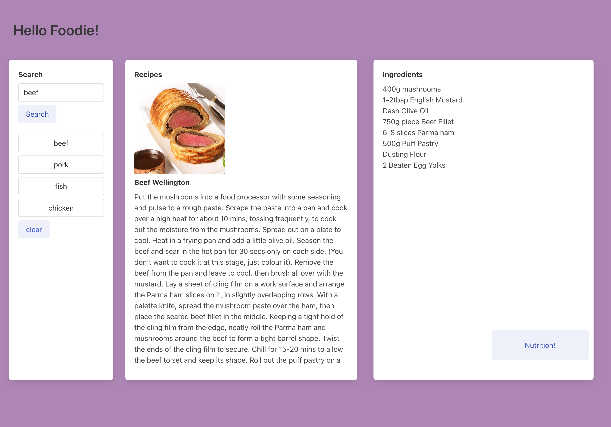

Project-1-Get-Food
Description
User Story AS user I want to view all the resturants in my area SO THAT I can eat lunch with my friends.

Acceptance Criteria
Use a CSS framework other than Bootstrap.

Be deployed to GitHub Pages.

Be interactive (i.e: accept and respond to user input).

Use at least two server-side APIs.

Does not use alerts, confirms, or prompts (use modals).

Use client-side storage to store persistent data.

Be responsive.

Have a polished UI.

Have a clean repository that meets quality coding standards (file structure, naming conventions, follows best practices for class/id-naming conventions, indentation, quality comments, etc.).

Have a quality README (with unique name, description, technologies used, screenshot, and link to deployed application).

Work Completed
Website
https://matt-bull1.github.io/Project-1-Get-Food/#
Screenshot

Contact
["Enter Name here" on Github](Apply your url link to your own github) ["Enter Name here" on Github](Apply your url link to your own github) [Matt Bull](https://github.com/Matt-Bull1) Nestor Montañez on Github